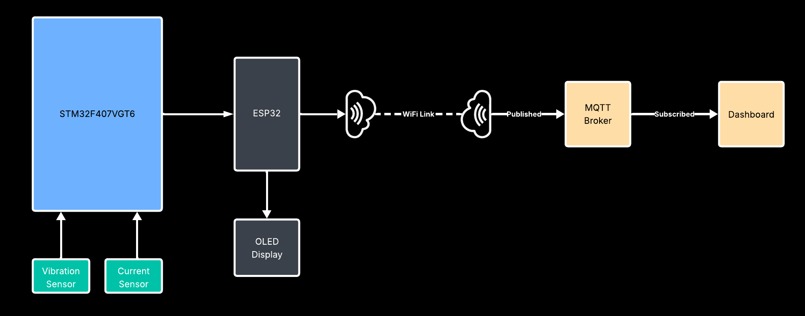
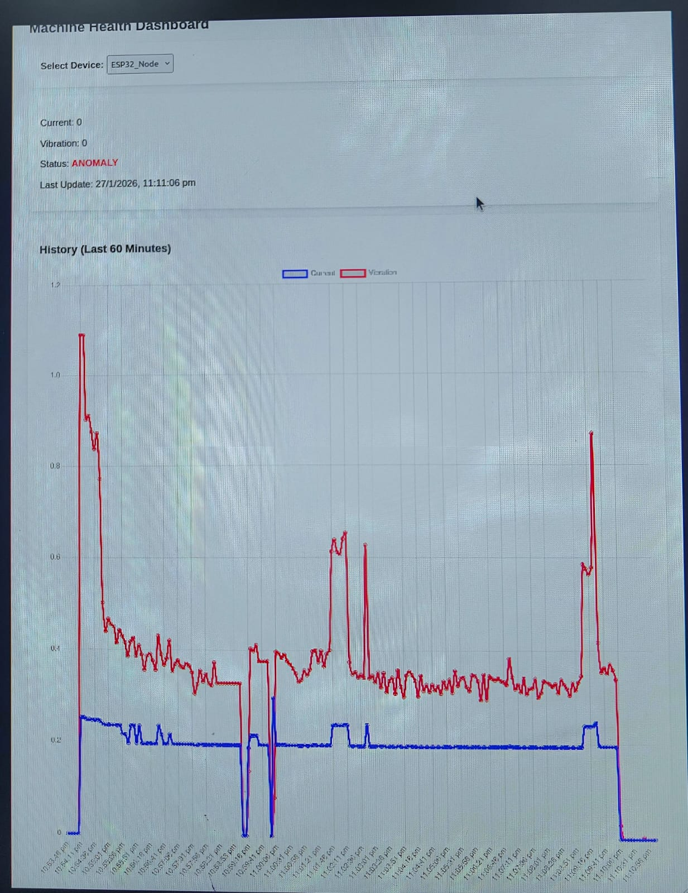

# Smart Sensor Node for Machine Health Monitoring

[](https://www.st.com/)
[](https://www.tensorflow.org/lite/microcontrollers)
[](https://aws.amazon.com/iot-core/)
[](LICENSE)

## 📌 Overview
This project implements a **Smart Sensor Node** capable of monitoring the health of rotating machinery in real-time. By leveraging **TinyML on the Edge (STM32)**, the system performs local fault classification (Normal, Warning, Fault) without relying solely on the cloud. Data is visualized locally on an OLED display and synchronized with **AWS IoT Core** via an ESP32 bridge for remote monitoring.

## 📖 Table of Contents
- [Key Features](#-key-features)
- [System Architecture](#-system-architecture)
- [Hardware Setup](#-hardware-setup)
- [Software & Tools](#-software--tools)
- [Directory Structure](#-directory-structure)
- [Installation & Usage](#-installation--usage)
- [Results & Dashboard](#-results--dashboard)
- [Team](#-team)

---

## ✨ Key Features
- **Multi-Parameter Sensing:** Real-time monitoring of Temperature, Current, Vibration, and Speed (RPM).
- **Edge Intelligence:** Runs TinyML models locally on the STM32F407VGT6 to detect anomalies instantly.
- **Hybrid Connectivity:** - **Local:** OLED Display & SD Card Logging.
  - **Cloud:** MQTT transmission to AWS IoT Core via ESP32.
- **Robust Data Handling:** Efficient signal processing and feature extraction at the edge.

---

## 🏗 System Architecture

The system is divided into three main layers: Sensing, Processing (Edge), and Communication (Cloud).


1. **Sensing Layer:** Sensors collect raw data from the machine.
2. **Processing Layer (STM32):** Pre-processes data, runs the TFLite model, and determines machine health.
3. **Communication Layer (ESP32):** Acts as a Wi-Fi bridge to send data to AWS.

---

## 🔌 Hardware Setup

### Component List
| Component | Description |
|-----------|-------------|
| **Microcontroller** | STM32F407VGT6 Discovery Board |
| **Comms Module** | ESP32 (Wi-Fi & MQTT Bridge) |
| **Sensors** | Vibration (Piezo/SW-420), Current (ACS712)|
| **Display** | 0.96" OLED I2C Display |

### Circuit Diagram


---

## 🛠 Software & Tools
- **Firmware Development:** STM32CubeIDE (C/C++), Arduino IDE (for ESP32).
- **Machine Learning:** Edge Impulse / TensorFlow Lite for Microcontrollers.
- **Cloud Platform:** AWS IoT Core (MQTT Protocol).
- **Data Analysis:** Python (Jupyter Notebooks) for model training.

---

## 📂 Directory Structure

```bash
├── stm32_firmware/       # Source code for STM32F407 (Main Logic)
│   ├── Core/             # HAL Drivers and Main loops
│   ├── TinyML/           # TFLite model arrays and inference engine
│   └── Drivers/          # Sensor drivers (OLED, SD Card, etc.)
├── esp32_firmware/       # Source code for ESP32 (MQTT Bridge)
├── ml/                   # Python scripts for training and dataset
├── docs/                 # Documentation, diagrams, and images
└── README.md             # Project documentation
```
## 🚀 Installation & Usage
1. STM32 Firmware
```Open stm32_firmware in STM32CubeIDE.
Build the project to generate the .elf or .bin file.
Flash the code to the STM32F407 board.
```
2. ESP32 Bridge
```Open esp32_firmware in Arduino IDE.
Update the SSID, PASSWORD, and AWS_ENDPOINT in the code.
Flash to the ESP32 module.
```
3. Running the System
```Power up the system. The STM32 will initialize sensors.
The OLED should display "System Init..." followed by real-time sensor values.
If a fault is simulated (e.g., obstructing the fan), the display will show "Condition: FAULT".
Check the AWS IoT Console to see the data stream in real-time.
```
## 📊 Results & Dashboard
> Local OLED Output
> AWS IoT Dashboard


## 👥 Team
Project developed at CDAC PG DESD, ACTS Pune
```
- Rohit Bhoge
- Navin Bharadwaj
- Ajinkya Sawant
- Sandesh Soni
- Samriddh Shrivastav
```
📜 License
This project is open-source and available under the MIT License.
